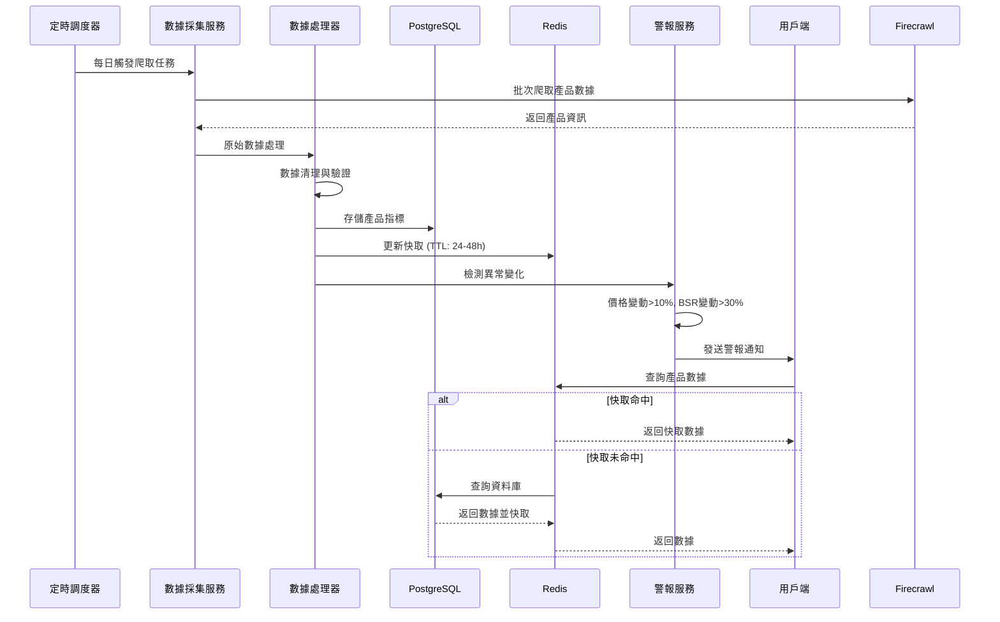
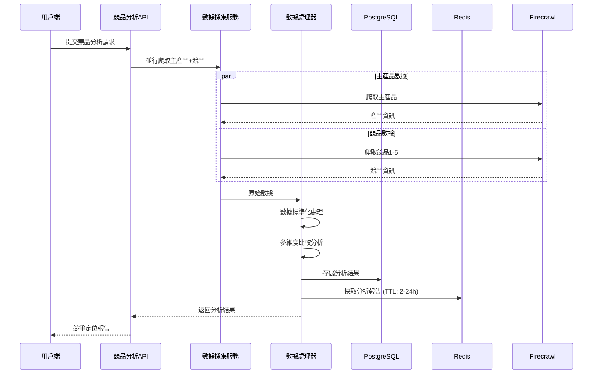
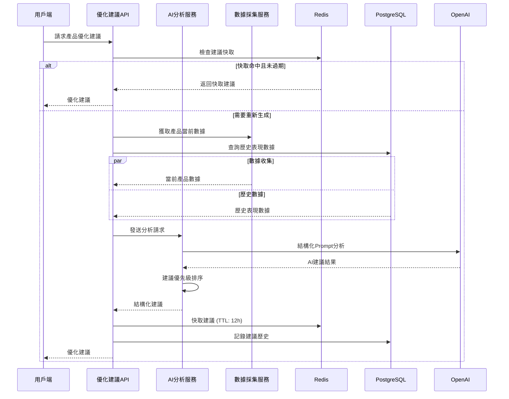

# 數據流向設計

## 產品追蹤數據流 (選項1)

```mermaid
sequenceDiagram
    participant Scheduler as 定時調度器
    participant Collector as 數據採集服務
    participant Processor as 數據處理器
    participant DB as PostgreSQL
    participant Cache as Redis
    participant Alert as 警報服務
    participant User as 用戶端

    %% 數據收集流程
    Scheduler->>Collector: 每日觸發爬取任務
    Collector->>Firecrawl: 批次爬取產品數據
    Firecrawl-->>Collector: 返回產品資訊
    Collector->>Processor: 原始數據處理
    
    %% 數據處理與存儲
    Processor->>Processor: 數據清理與驗證
    Processor->>DB: 存儲產品指標
    Processor->>Cache: 更新快取 (TTL: 24-48h)
    
    %% 異常檢測與警報
    Processor->>Alert: 檢測異常變化
    Alert->>Alert: 價格變動>10%, BSR變動>30%
    Alert->>User: 發送警報通知
    
    %% 用戶查詢
    User->>Cache: 查詢產品數據
    alt 快取命中
        Cache-->>User: 返回快取數據
    else 快取未命中
        Cache->>DB: 查詢資料庫
        DB-->>Cache: 返回數據並快取
        Cache-->>User: 返回數據
    end
```

## 競品分析數據流 (選項2)

```mermaid
sequenceDiagram
    participant User as 用戶端
    participant API as 競品分析API
    participant Collector as 數據採集服務
    participant Processor as 數據處理器
    participant DB as PostgreSQL
    participant Cache as Redis

    %% 用戶發起分析請求
    User->>API: 提交競品分析請求
    API->>Collector: 並行爬取主產品+競品
    
    par 主產品數據
        Collector->>Firecrawl: 爬取主產品
        Firecrawl-->>Collector: 產品資訊
    and 競品數據
        Collector->>Firecrawl: 爬取競品1-5
        Firecrawl-->>Collector: 競品資訊
    end
    
    %% 數據標準化與分析
    Collector->>Processor: 原始數據
    Processor->>Processor: 數據標準化處理
    Processor->>Processor: 多維度比較分析
    
    %% 存儲與快取
    Processor->>DB: 存儲分析結果
    Processor->>Cache: 快取分析報告 (TTL: 2-24h)
    Processor-->>API: 返回分析結果
    API-->>User: 競爭定位報告
```

## 優化建議數據流 (選項3)

```mermaid
sequenceDiagram
    participant User as 用戶端
    participant API as 優化建議API
    participant AI as AI分析服務
    participant Collector as 數據採集服務
    participant Cache as Redis
    participant DB as PostgreSQL

    %% 用戶請求優化建議
    User->>API: 請求產品優化建議
    
    %% 檢查快取
    API->>Cache: 檢查建議快取
    alt 快取命中且未過期
        Cache-->>API: 返回快取建議
        API-->>User: 優化建議
    else 需要重新生成
        %% 收集數據
        API->>Collector: 獲取產品當前數據
        API->>DB: 查詢歷史表現數據
        
        %% AI分析
        par 數據收集
            Collector-->>API: 當前產品數據
        and 歷史數據
            DB-->>API: 歷史表現數據
        end
        
        API->>AI: 發送分析請求
        AI->>OpenAI: 結構化Prompt分析
        OpenAI-->>AI: AI建議結果
        
        %% 處理與快取
        AI->>AI: 建議優先級排序
        AI-->>API: 結構化建議
        API->>Cache: 快取建議 (TTL: 12h)
        API->>DB: 記錄建議歷史
        API-->>User: 優化建議
    end
```